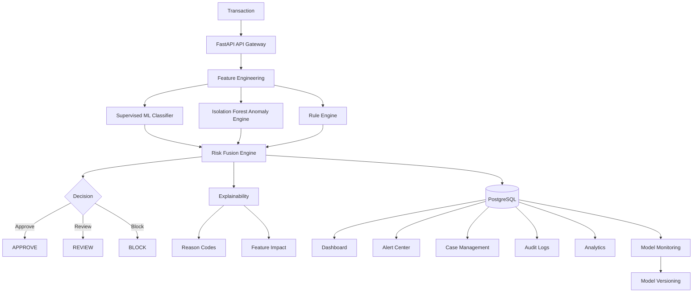

# FraudGuard Architecture

FraudGuard is an explainable, multi-layer fraud intelligence platform. The
request path is deliberately split into independently testable stages:

## Runtime Boundaries

### API gateway

The FastAPI application authenticates users, validates transaction payloads,
enforces role checks, and exposes transaction, dashboard, alert, and admin
contracts. CORS is restricted to the local analyst UI during development.

### Feature engineering

`TransactionProcessor` derives request-time signals from the transaction and
the user's recent history:

- amount anomaly
- transaction velocity
- device novelty and fingerprint history
- location deviation and impossible travel
- unusual transaction time
- behavioral deviation from recent transactions

`ModelRuntime` converts the transaction into the trained model's feature frame.

### Detection and risk fusion

The supervised fraud classifier produces fraud probability. Isolation Forest
produces an anomaly score. The rule engine emits typed rule matches such as
`HIGH_AMOUNT`, `NEW_DEVICE`, `VELOCITY_ANOMALY`, `IMPOSSIBLE_TRAVEL`, and
`BEHAVIOR_DEVIATION`.

`RiskEngine` normalizes these signals, applies configurable weights, fuses rule
points, and maps the result to:

| Risk score | Risk level | Decision |
| --- | --- | --- |
| `< 35` | LOW | APPROVE |
| `35-69.99` | MEDIUM | REVIEW |
| `>= 70` | HIGH | BLOCK |

Every assessment includes the component signals, risk contribution points,
reason codes, human-readable explanations, and matched rules.

### Persistence and intelligence views

PostgreSQL stores users, devices, merchants, transactions, fraud alerts, risk
events, and model versions. A transaction stores its final decision and
explainability evidence, while risk events preserve an assessment audit trail.

The Next.js UI consumes these contracts through the API client and provides:

- dashboard metrics, risk distribution, activity, trend, and model health
- transaction history and explainable transaction details
- filtered alert monitoring
- simulator access to the live analysis pipeline
- role-gated administrator access

## Extension Points

The schema already includes `RiskEvent` and `ModelVersion` boundaries for audit
logs and model registry work. Case management, investigator assignment,
false-positive labelling, graph-based fraud-ring analysis, and richer model
monitoring should be added as separate API and migration slices behind those
boundaries rather than mixed into transaction scoring.
