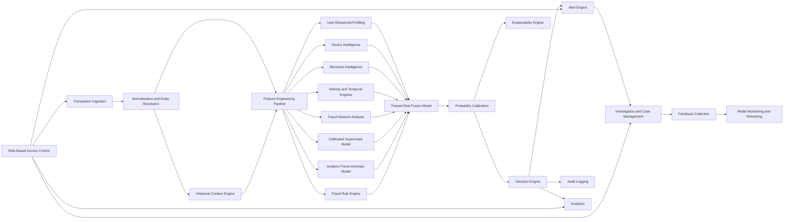

# FRAUDGUARD X Architecture

FRAUDGUARD X is an event-centric, entity-aware fraud intelligence and
investigation platform. It evaluates transactions in historical context and
combines trained model outputs with behavioral, temporal, network, and rule
evidence.

The final fraud probability must come from a trained and calibrated model. The
platform must not use a manually weighted average of arbitrary signals.

## Phase 2 System Flow



## Detection Architecture

### Transaction ingestion

Support synchronous scoring, batch ingestion, webhooks, and future stream
consumers. Every event requires an idempotency key, event timestamp, source,
organization, account, and transaction identity.

Ingestion validates and normalizes the event but delegates feature generation
and scoring to separate application services.

### Historical context engine

Provide point-in-time history for accounts, users, devices, merchants, IP
addresses, payment instruments, beneficiaries, and locations. Features must
only use data that existed before the event being scored.

### Feature engineering pipeline

Use versioned feature sets with explicit point-in-time joins, missing-value
handling, freshness indicators, and feature validation. Persist the feature
snapshot used for every decision.

### Behavioral profiling

Maintain evolving profiles for normal amount, timing, location, merchant,
device, and frequency behavior. Update profiles only after outcomes are known,
so suspicious activity cannot immediately redefine normal behavior.

### Device intelligence

Track devices globally across accounts. Derive shared-device counts, account
switching frequency, device fan-out, automation indicators, and device
reputation. Device identity must not be scoped only to one user.

### Merchant intelligence

Maintain merchant fraud, chargeback, decline, review, velocity, category,
country, device-concentration, and network-risk features.

### Velocity and temporal engines

Calculate counts, amounts, distinct entities, failures, bursts, inter-arrival
times, time-of-day deviation, impossible travel, amount sequences, and repeated
suspicious activity across multiple time windows and entity dimensions.

### Fraud network analysis

Represent users, accounts, devices, merchants, IP addresses, payment
instruments, locations, and transactions as a time-aware graph. Produce graph
features such as shared-entity counts, connected-component size, suspicious
neighbor ratio, community risk, fan-out, and proximity to known fraud.

PostgreSQL relationship tables can be the initial source of truth. A graph
projection or graph database can be introduced when network workloads require
it.

## Machine Learning and Fusion

### Supervised fraud model

Use LightGBM when available because it is already declared in the project
dependencies. Fall back to `HistGradientBoostingClassifier` if LightGBM is
unavailable. Random Forest remains a baseline, not the target production model.

Train on application-domain features using time-based and entity-aware splits.
Track precision, recall, PR-AUC, fraud recall at fixed false-positive rates,
calibration, and segment-level performance.

The supervised model produces the primary base probability:

```text
base_fraud_probability
```

### Unsupervised anomaly model

Use Isolation Forest for behavioral anomaly evidence. Its output is an anomaly
score and must not be treated as a fraud probability.

### Fraud rule engine

Rules cover deterministic evidence such as impossible travel, compromised
devices, excessive authorization attempts, blocked entities, and account
recovery followed by high-value activity. Rules are versioned, auditable, and
independently testable.

Rules provide features and evidence to the fusion layer rather than manually
adding points to the final score.

### Trained risk fusion

Use a trained meta-model, such as calibrated logistic regression or LightGBM,
over out-of-fold outputs from the supervised model, anomaly engine, behavioral
profile, network model, temporal features, merchant intelligence, and rule
indicators.

Conceptually:

$$
p_{fusion} = g(p_{supervised}, e_{anomaly}, e_{behavior}, e_{network},
e_{velocity}, e_{rules}, x_{context})
$$

Here, $g$ is a trained model, not a manually selected weighted sum.

### Probability calibration

Calibrate the supervised model and fusion model using isotonic regression or
Platt scaling. Monitor calibration curves and Brier score. The exposed
`fraud_probability` must correspond to observed fraud frequency within defined
confidence limits.

## Decision and Explainability

The decision engine applies versioned, cost-aware policies to the calibrated
probability and operational context.

Supported decisions:

- `APPROVE`
- `CHALLENGE`
- `REVIEW`
- `HOLD`
- `BLOCK`

`risk_score` is derived from the calibrated probability rather than an
independent arbitrary formula:

$$
risk\_score = 100 \times fraud\_probability
$$

Decision thresholds are optimized using false-negative, false-positive, review,
and fraud-loss costs. Thresholds are versioned by organization, product,
transaction type, and policy.

Every decision includes model version, calibration version, feature-set version,
policy version, top contributing features, rule matches, behavioral deviations,
network evidence, and data-quality warnings.

## Operational Intelligence

### Alert engine

Create deduplicated, prioritized alerts and group related events into campaigns.
Support assignment, suppression, escalation, SLA tracking, and evidence
snapshots.

### Investigation and case management

Cases group alerts, transactions, and related entities. They support assignment,
notes, evidence, status transitions, dispositions, and confirmed-fraud or
false-positive outcomes.

### Attack simulator

Run attack scenarios in a separate simulation tenant or namespace. Simulated
events must never pollute production transaction analytics or model feedback.
Scenarios require labels, seeds, versions, and detection metrics.

### Model monitoring

Monitor feature drift, prediction drift, calibration, missingness, freshness,
latency, precision, recall, false positives, false negatives, and segment
performance. Monitoring values must come from telemetry rather than static
status strings.

### Feedback collection

Capture analyst dispositions, chargebacks, disputes, reversals, and confirmed
account takeover outcomes. Link feedback to the transaction, alert, case,
decision, model version, and feature-set version.

### Analytics

Provide time-windowed analytics for volume, approval, challenge, review, block,
fraud loss, false positives, alert backlog, merchant risk, device risk, network
campaigns, model quality, and drift.

### Audit logging

Append-only audit records cover authentication, role changes, rule changes,
policy changes, model activation, threshold changes, case activity, alert
disposition, exports, and administrative access.

### Role-based access control

Use organization-aware roles such as `PLATFORM_ADMIN`, `ORG_ADMIN`,
`FRAUD_MANAGER`, `INVESTIGATOR`, `ANALYST`, `AUDITOR`, and `READ_ONLY`.
Permissions must be enforced in API handlers and database queries, not only in
frontend navigation.

## Decision Response Contract

Every completed assessment returns:

```json
{
	"fraud_probability": 0.873,
	"anomaly_score": 0.91,
	"behavior_score": 0.84,
	"network_score": 0.76,
	"rule_score": 0.88,
	"risk_score": 87.3,
	"risk_level": "HIGH",
	"decision": "BLOCK",
	"reason_codes": [
		"NEW_DEVICE_FOR_ACCOUNT",
		"VELOCITY_SPIKE_15_MINUTES",
		"DEVICE_SHARED_WITH_HIGH_RISK_ACCOUNTS"
	],
	"model_version": "fraud-lgbm-2026-09-01",
	"calibration_version": "calibration-2026-09-01",
	"feature_set_version": "features-v2",
	"policy_version": "policy-v1"
}
```

## Database Schema

Core tables:

- `organizations`
- `users`
- `roles`
- `user_roles`
- `accounts`
- `transactions`
- `devices`
- `merchants`
- `ip_addresses`
- `payment_instruments`

Intelligence tables:

- `entity_relationships`
- `behavior_profiles`
- `feature_snapshots`
- `risk_decisions`
- `model_versions`
- `rules`
- `alerts`
- `cases`
- `case_entities`
- `feedback_labels`
- `audit_logs`

Transactions reference the account, merchant, device, payment instrument,
source event, model version, policy version, and feature-set version. Risk
decisions preserve all component evidence and reason codes used for the final
decision.

## API Contracts

Primary API groups:

```text
POST  /api/v1/events/transactions
GET   /api/v1/transactions
GET   /api/v1/transactions/{id}
GET   /api/v1/transactions/{id}/evidence

GET   /api/v1/alerts
GET   /api/v1/alerts/{id}
PATCH /api/v1/alerts/{id}
POST  /api/v1/alerts/{id}/create-case

GET   /api/v1/cases
POST  /api/v1/cases
GET   /api/v1/cases/{id}
PATCH /api/v1/cases/{id}
POST  /api/v1/cases/{id}/disposition

GET   /api/v1/accounts/{id}/profile
GET   /api/v1/devices/{id}/intelligence
GET   /api/v1/merchants/{id}/intelligence
GET   /api/v1/entities/{id}/connections

GET   /api/v1/analytics/overview
GET   /api/v1/analytics/model-performance
GET   /api/v1/analytics/drift

GET   /api/v1/models
POST  /api/v1/models/{id}/activate
GET   /api/v1/policies
POST  /api/v1/policies

POST  /api/v1/feedback/transactions/{id}
POST  /api/v1/feedback/alerts/{id}
POST  /api/v1/feedback/cases/{id}
```

## Phase 2 Implementation Boundaries

The existing PostgreSQL, SQLAlchemy, Alembic, authentication, model artifact,
and explainability foundations can be reused. Transaction processing, model
features, risk fusion, alert lifecycle, analytics, simulator persistence, and
administration should be rebuilt around the event and entity model described
above.
